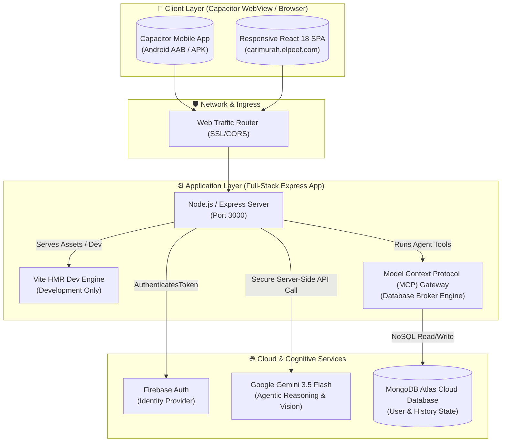
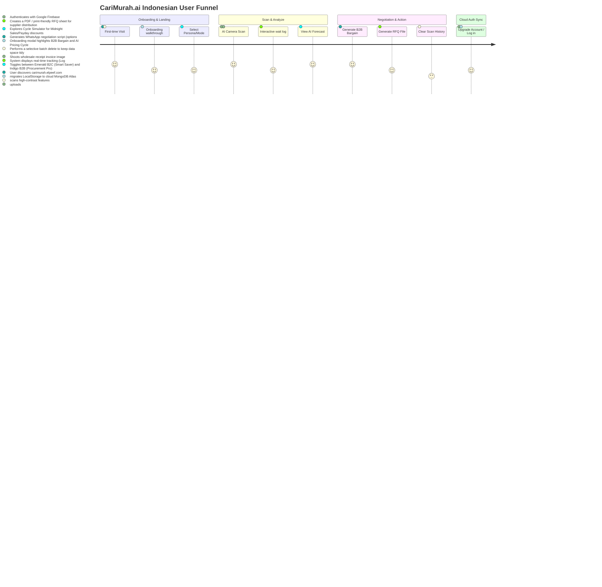
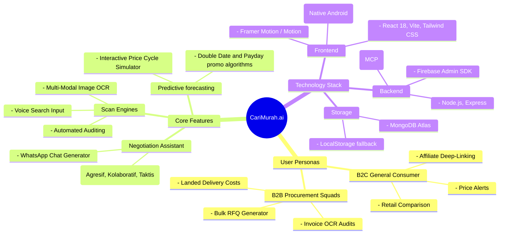
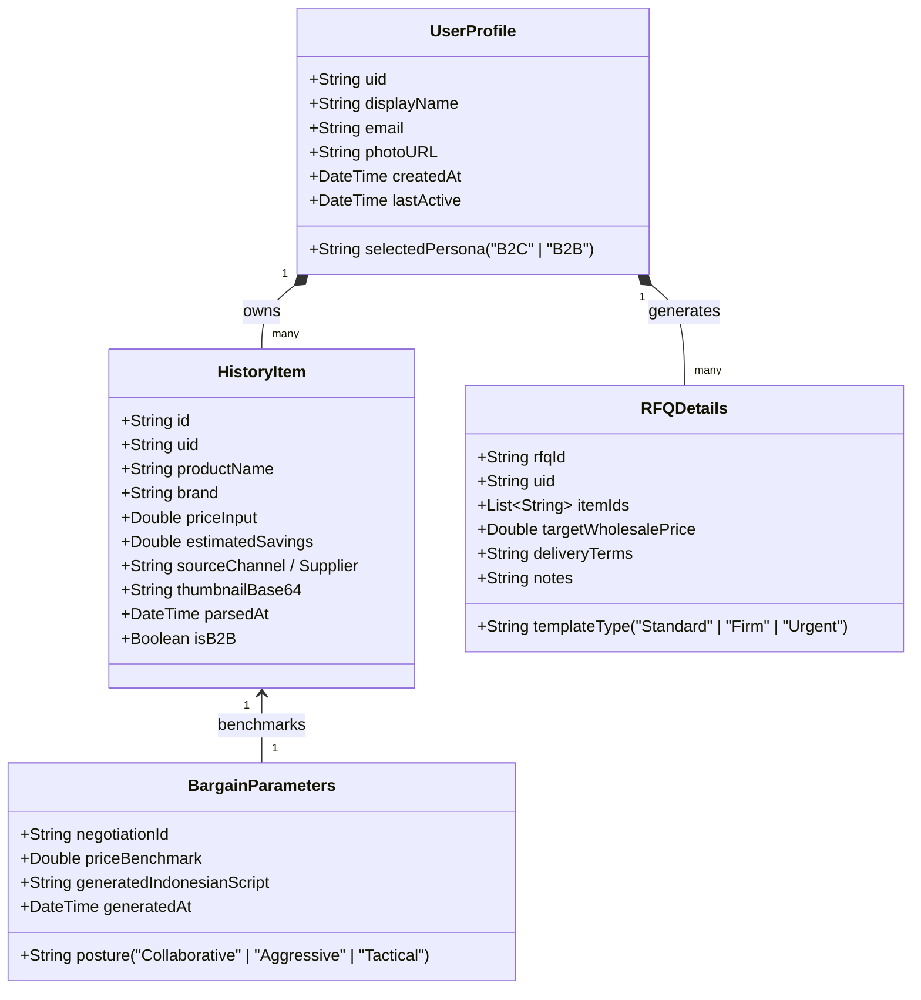

# 🏛️ CariMurah.ai Architecture & System Topology

This document details the high-fidelity multi-agent system, data streaming pipelines, user journey, database models, and cloud topology powering **CariMurah.ai**.

---

## 1. System Topology (System Architecture)

CariMurah.ai utilizes a hybrid architecture of a lightweight mobile **Capacitor WebView / Web App** frontend communicating with a secure, centralized server-side **Node.js Gateway API**, which encapsulates secure integrations with **Google Gemini**, **MongoDB Atlas**, and **Firebase Authentication**.

---

## 2. Dynamic Data Flow

This chart shows the exact real-time pipeline when a shopper uploads a photo or scans a grocery receipt. The API key is fully hidden on the server, ensuring production security.

```mermaid
sequenceDiagram
    autonumber
    actor User as 👤 B2C/B2B User
    participant Client as 📱 React App (Capacitor)
    participant Server as ⚙️ Express Server (Proxy)
    participant Gem as 🧠 Google Gemini AI
    participant DB as 🗄️ MongoDB Atlas (MCP)

    User->>Client: Uploads Receipt/Invoice (Camera/Image)
    Client->>Client: Compress to Base64 (Safe Storage size)
    Client->>Server: POST /api/analyze-receipt (Base64 + User JWT Token)
    
    rect rgb(15, 23, 42)
        Note over Server: Secure Proxy Checks JWT Token
        Server->>Server: Validate authorization with Firebase Admin
        Server->>Gem: Multi-Modal call with prompt (Indonesian localized)
    end

    Gem-->>Server: Multi-Agent JSON: Product Name, Brand, Price, Savings
    
    rect rgb(30, 41, 59)
        Note over Server: Match historical pricing or search web
        Server->>DB: Query historical price records for B2B supplier contract benchmark
        DB-->>Server: Return benchmark data
    end

    Server->>DB: Save Scan Result to history collection via MCP
    DB-->>Server: OK (Record persistent)
    Server-->>Client: Clean HTTP response (Payload: Scan results + Saving recommendations)
    Client-->>User: Renders high-contrast dashboard with Recharts trends
```

---

## 3. User Journey Map

CariMurah.ai features a highly streamlined Indonesian procurement funnel spanning both mobile WebView (B2C Smart savers) and B2B large-scale wholesale procurement teams.

---

## 4. Feature Brain Map (Mindmap)

---

## 5. Logical Class & Schema Design

Unified data model representations supporting seamless B2C `localStorage` guest caching and full-stack enterprise B2B MongoDB persistence.

---

## 🛠️ Performance & Scalability Design
*   **Lazy Loading**: Components and heavy panels are dynamically loaded to minimize physical footprint in mobile Capicitor WebViews.
*   **State Decoupling**: Large static data objects are moved out of the hot React lifecycle loop into dedicated `/src/data.ts`.
*   **Compression Offloading**: Complex image matrices are formatted in client memory before shipment to `/api/*` pipelines to lower Node server I/O stress.
*   **Fallback Reliability**: The backend seamlessly handles failures of third-party API routes without affecting local client usage.
